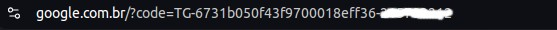

# Laravel API Desafio

# Passos para rodar o projeto

```bash
git clone https://github.com/caiostarke/laravel-api-desafio.git
```

```bash
cd laravel-api-desafio
```

```bash
composer install
```

```bash    
cp .env.example .env
```

# Requirementos

### Caso nao queira instalar e configurar o mysql voce pode usar o docker. 
- Docker 
- Docker Compose

Configure essas variaveis de ambiente para que nao haja problemas na hora de rodar o mysql no docker (Ja deixei valores padrao no .env.example caso nao queira mudar)

```.env
DB_CONNECTION=mysql
DB_HOST=127.0.0.1
DB_PORT=3306
DB_DATABASE=laravel_api_desafio
DB_USERNAME=root
DB_PASSWORD=
MYSQL_ROOT_PASSWORD=
```


- Configure as seguintes variaveis de ambiente no seu arquivo *.env* com as chaves que voce ganha quando cria uma aplicacao para ter acesso a API do mercado livre

- Caso voce consiga configurar na sua aplicacao do mercado livre developers a redirectURI com o valor "https://localhost:8000/redirect" a aplicacao funcionara corretamente (Infelizmente isso aparentemente nao tem funcionado mais, eu usei o redirectURI com o valor https://google.com.br e peguei o codigo gerado manualmente).

```
MERCADO_LIVRE_CLIENT_ID=
MERCADO_LIVRE_CLIENT_SECRET=

# coloque exatamente como voce colocou na criacao da sua aplicacao caso contrario nao funcionara
MERCADO_LIVRE_REDIRECT_URI=
```

```bash
php artisan key:generate
```

```bash
docker compose up -d

or

docker-compose up -d
```

```bash
php artisan migrate
```

```bash
php artisan serve
```

```bash
npm install
```

```bash
npm run dev
```

# Proximos Passos

- Va para o http://localhost:8000/register, se cadastre e va para http://localhost:8000/.

- Clique no botao.

- Caso voce tenha conseguido configurar o redirectURI para o localhost:8000/redirect voce ja estara auteticado e pronto para seguir para http://localhost:8000/product/create

- Caso nao tenha conseguido configurar corretamente o redirectURI, copie o code que voce recebeu na pagina de redirecionamento.



 - Cole o codigo copiado nesse link http://localhost:8000/redirect?code={code} e voce ja estara auteticado e pronto para seguir para http://localhost:8000/product/create.


